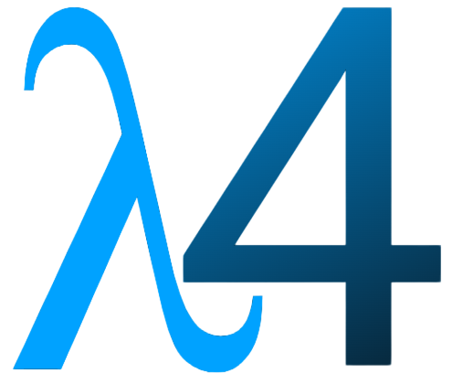

<h3> :running_man: &nbsp;Sobre mim </h3>

- 🤔 &nbsp; Explorando novas tecnologias e desenvolvendo soluções de software.
- 🎓 &nbsp; Estudando Formação Desenvolvedor Moderno na <a href="https://devsuperior.com.br/cursos">DevSuperior</a>.
- 🌱 &nbsp; Aprendendo mais sobre Spring e React.
- ⚡ &nbsp; Apaixonado pelo esporte e atividade física. 

<h3> :rocket: &nbsp;Minha Stack </h3>

**Aplicações e Dados**

  
  
  
  
  
  
  
  

**Utilidades**

  
  

**DevOps**

  
  
  

**Ferramentas de Desenvolvimento**

  
  
  
  

